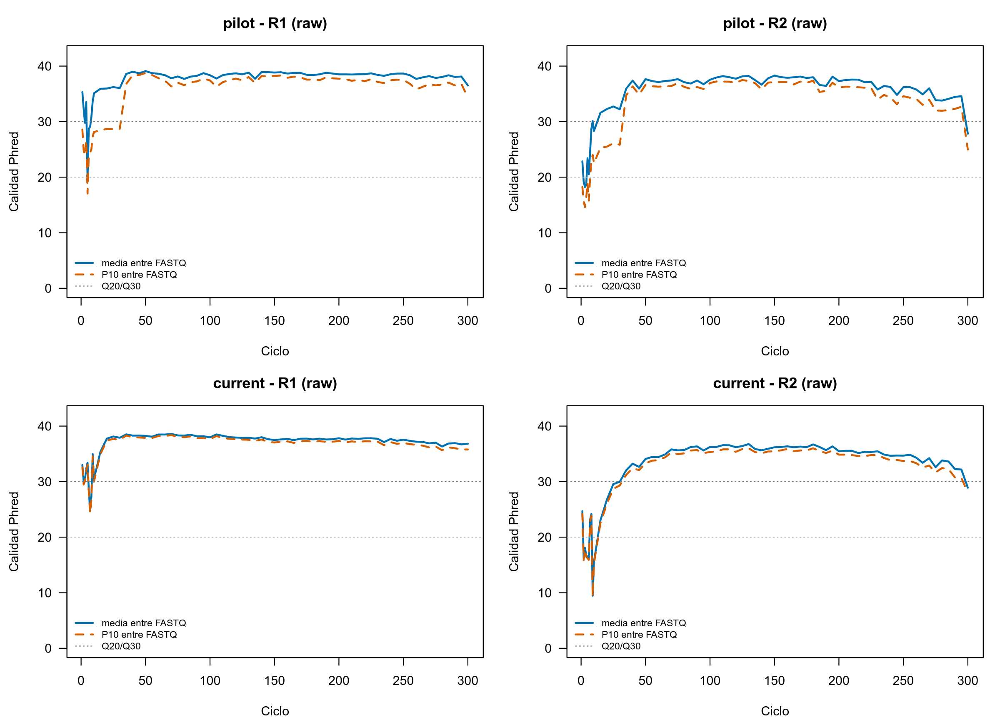
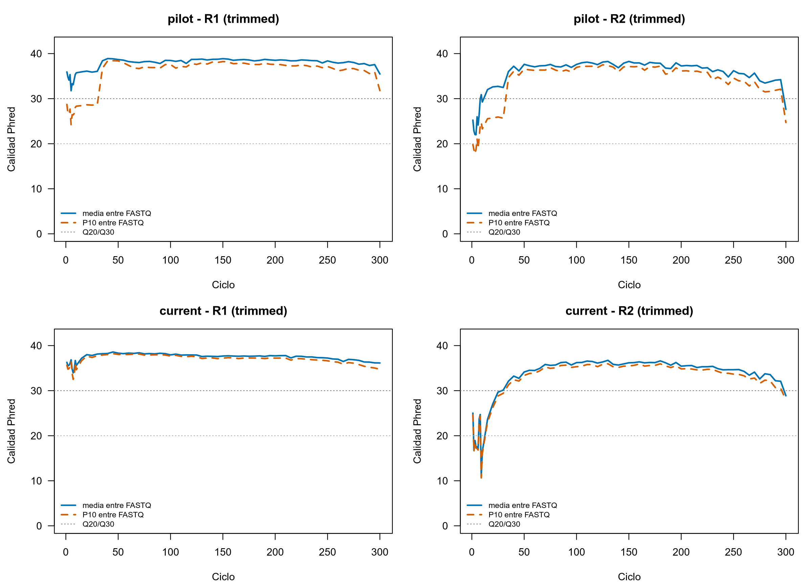

## Auditoría de bibliotecas y pares FASTQ

Se validaron 198 registros técnicos y 396 FASTQ: 46 bibliotecas del ensayo
`pilot` y 152 del ensayo `current`. Cada biblioteca tiene un único par R1/R2 y
no se identificaron FASTQ no referenciados. FastQC y MultiQC se ejecutaron antes
y después del recorte de primers; por diseño, los conteos de R1 y R2 coinciden
en cada biblioteca.

El resumen de bibliotecas y pares de lecturas se presenta en la
@tbl-preprocessing-summary.

::: {#tbl-preprocessing-summary}
| Ensayo | Bibliotecas | Pares de lecturas crudos | Pares tras recorte | Retención de pares |
|---|---:|---:|---:|---:|
| Piloto | 46 | 30,06 millones | 30,06 millones | 100,00 % |
| Ampliado actual | 152 | 29,91 millones | 29,91 millones | 100,00 % |
| **Total** | **198** | **59,97 millones** | **59,97 millones** | **100,00 %** |

: Bibliotecas y pares de lecturas antes y después del recorte de primers por
secuencia. Las profundidades son idénticas porque no se descartó ningún par.
:::

Las profundidades agregadas por tipo de biblioteca están disponibles en las
tablas de [FASTQ crudos](../tables/04_control_calidad_preprocesamiento/Table-4.1-profundidad-bibliotecas-crudas.tsv)
y [FASTQ recortados](../tables/04_control_calidad_preprocesamiento/Table-4.1-profundidad-bibliotecas-recortadas.tsv).

## Informes de QC y MultiQC

Los informes de FastQC se integraron con MultiQC antes y después del recorte
[@Ewels2016]. La versión pública se regenera exclusivamente a partir de copias
temporales de los archivos `*_fastqc.zip`, conserva los nombres técnicos
autorizados y excluye las rutas internas de computación. Se puede consultar el
[informe previo al recorte](../multiqc/04_control_calidad_preprocesamiento/MultiQC-4.1-fastqc-crudo.html) y el
[informe posterior al recorte](../multiqc/04_control_calidad_preprocesamiento/MultiQC-4.2-fastqc-recortado.html).

La @fig-fastqc-raw-profiles presenta los perfiles de calidad de los FASTQ
crudos por ensayo y sentido de lectura. La @fig-fastqc-trimmed-profiles muestra
la misma evaluación después del recorte por secuencia.

{#fig-fastqc-raw-profiles fig-alt="Perfiles de calidad de los FASTQ crudos para los ensayos pilot y current, con paneles separados para R1 y R2."}

{#fig-fastqc-trimmed-profiles fig-alt="Perfiles de calidad de los FASTQ recortados para los ensayos pilot y current, con paneles separados para R1 y R2."}

## Recorte y verificación de primers

Cutadapt 5.2 buscó 341F (`CCTACGGGNGGCWGCAG`) en R1 y 805R
(`GACTACHVGGGTATCTAATCC`) en R2. Ambos primers se buscaron completos y
anclados al extremo 5′ (`^primer`), con tasa máxima de error de 0,15 y sin
indels. No se usaron `-u`, `-U` ni `--discard-untrimmed`.

Una lectura solo pierde 17 nt en R1 o 21 nt en R2 cuando Cutadapt detecta el
primer configurado; las lecturas sin coincidencia se preservan intactas. La no
coincidencia no demuestra la ausencia de primer: demuestra únicamente que no
existe evidencia configurada para cortar bases. Se retuvo el 100 % de los pares
en ambos ensayos y los 16 controles formales de preprocesamiento se superaron.

La retención y las coincidencias de primer se detallan en la
@tbl-primer-trimming.

::: {#tbl-primer-trimming}
| Ensayo | Pares de entrada | Pares de salida | Retención | Coincidencia R1 | Coincidencia R2 | R1 sin coincidencia, preservadas | R2 sin coincidencia, preservadas |
|---|---:|---:|---:|---:|---:|---:|---:|
| Piloto | 30,06 millones | 30,06 millones | 100,00 % | 57,8550 % | 19,3697 % | 42,1450 % | 80,6303 % |
| Ampliado actual | 29,91 millones | 29,91 millones | 100,00 % | 72,0326 % | 7,5323 % | 27,9674 % | 92,4677 % |

: Retención de pares, coincidencias completas ancladas de primer y lecturas sin
coincidencia preservadas tras el recorte por secuencia.
:::

Las métricas reproducibles se encuentran en [retención por ensayo](../tables/04_control_calidad_preprocesamiento/Table-4.2-retencion-primers-por-ensayo.tsv)
y [verificación de primers por secuencia](../tables/04_control_calidad_preprocesamiento/Table-4.2-verificacion-primers-por-secuencia.tsv).

## Profundidad de secuenciación de las biopsias repetidas

La comparación pareada utiliza las ocho biopsias presentes en el piloto y el
ensayo ampliado. Se trata de una comparación técnica de FASTQ crudos antes de
filtrado, fusión de pares o eliminación de quimeras. En todas ellas, la
profundidad de entrada fue mayor en el piloto; la media geométrica del cociente
piloto/ampliado fue 7,69 y la mediana 7,51. No se aplicó una prueba de hipótesis.

El resumen descriptivo de esta comparación se presenta en la
@tbl-repeated-depth-summary.

::: {#tbl-repeated-depth-summary}
| Métrica (8 biopsias emparejadas) | Piloto | Ampliado actual |
|---|---:|---:|
| Pares totales | 11,82 millones | 1,55 millones |
| Media por biopsia, DE | 1,48 (0,26) millones | 0,19 (0,04) millones |
| Mediana por biopsia [RIC] | 1,48 [1,44–1,58] millones | 0,20 [0,16–0,22] millones |
| Rango por biopsia | 0,94–1,84 millones | 0,14–0,26 millones |

: Profundidad de los pares de lecturas crudos en las biopsias repetidas.
:::

La @fig-repeated-depth muestra pares de lecturas en escala logarítmica. Cada
línea une la misma biopsia entre ambos ensayos; el eje vertical está expresado
en millones de pares, no en lecturas individuales.

{#fig-repeated-depth fig-alt="Gráfico de líneas pareadas que compara la profundidad de las ocho biopsias repetidas entre el piloto y el ensayo ampliado."}

Los valores técnicos individuales y el resumen se ofrecen en la
[tabla por biopsia](../tables/04_control_calidad_preprocesamiento/Table-4.3-profundidad-biopsias-repetidas.tsv)
y en el [resumen descriptivo](../tables/04_control_calidad_preprocesamiento/Table-4.3-resumen-profundidad-biopsias-repetidas.tsv).

::: {.callout-caution}
## Criterios de exclusión

Dos biopsias de profundidad muy baja se conservan en el conjunto inicial. Su
posible exclusión no se decidirá a partir del FASTQ crudo de forma aislada, sino
tras revisar la retención completa de DADA2, la fusión de pares, las quimeras y
el umbral de profundidad definido para el análisis final.
:::
