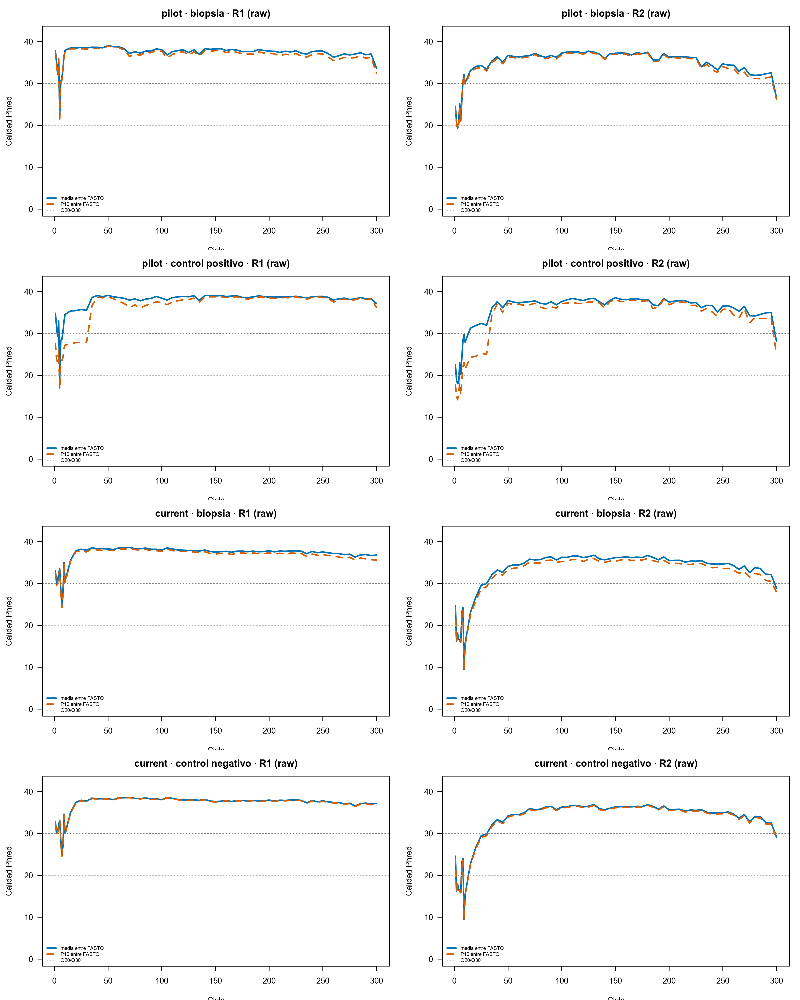
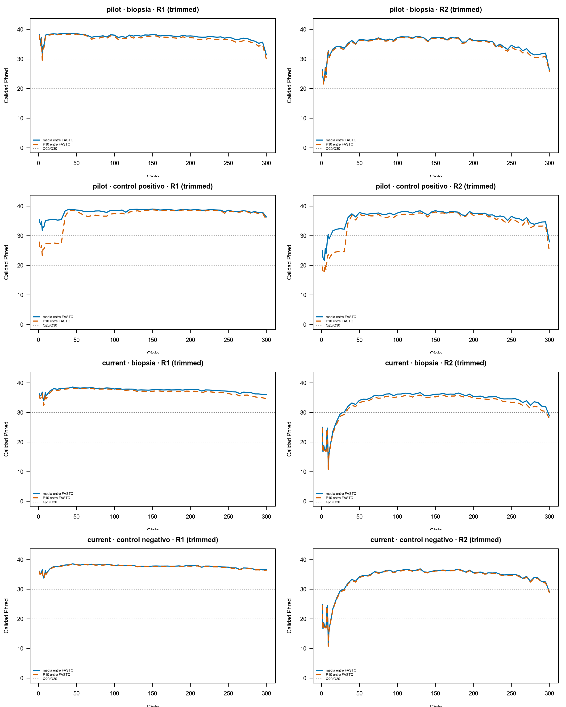
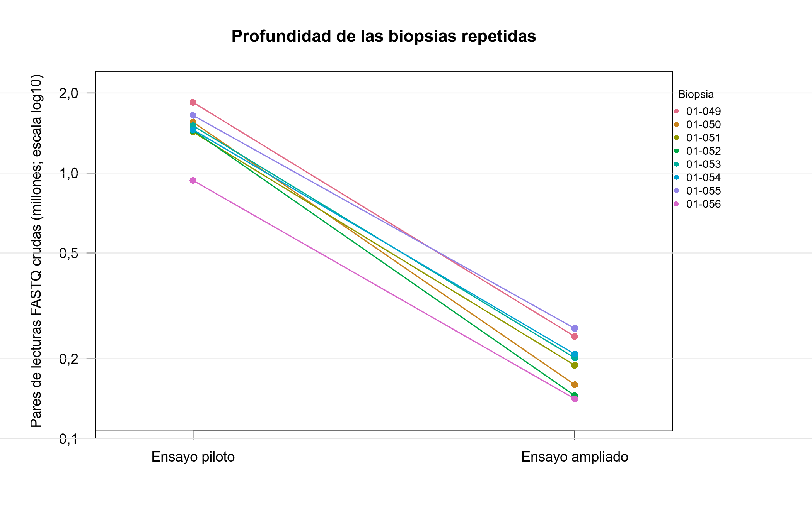
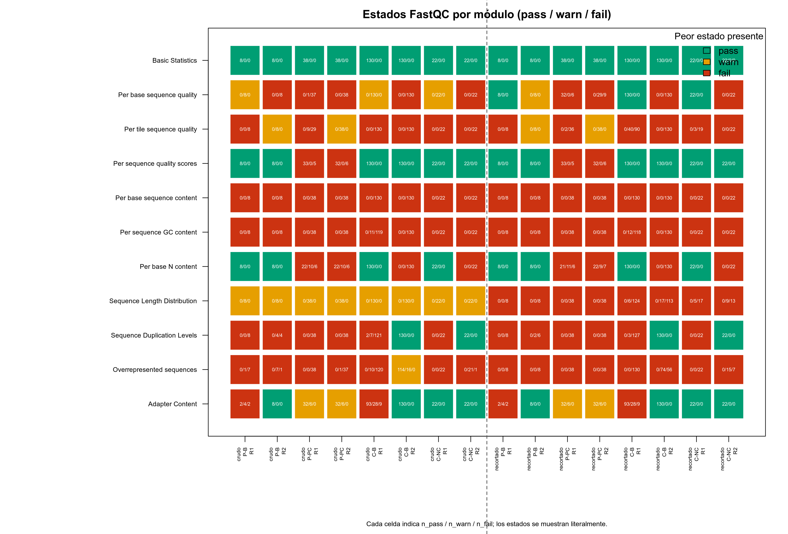
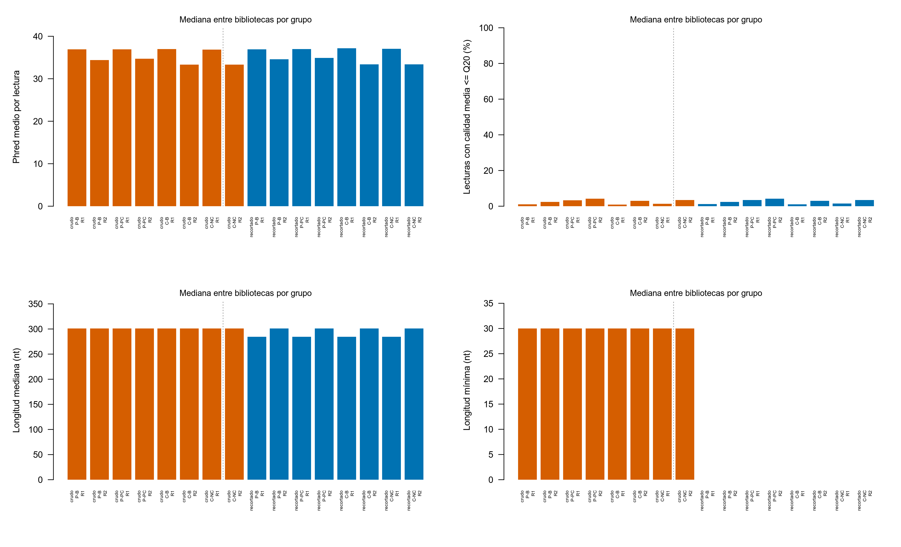
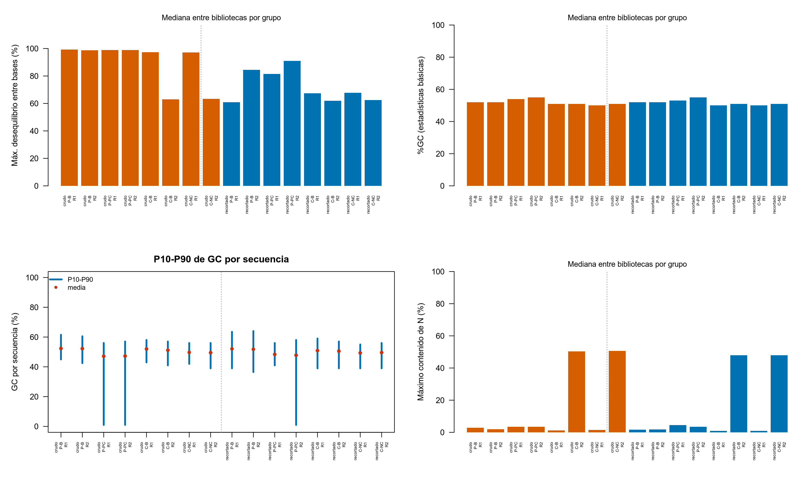
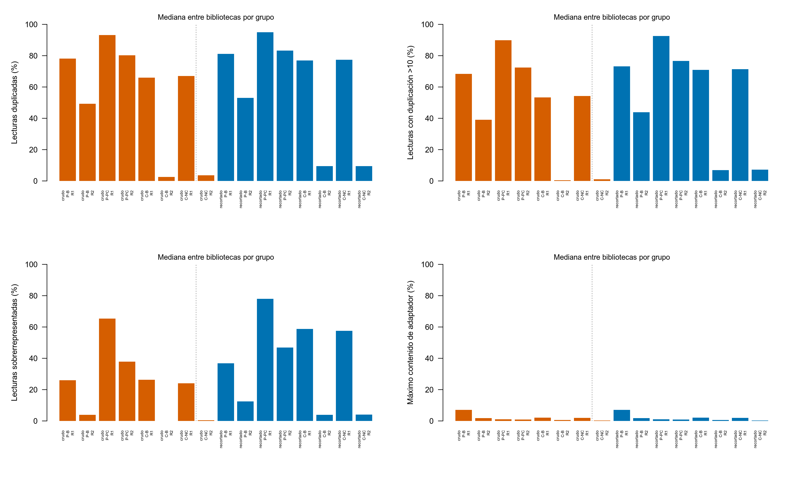

## Auditoría de bibliotecas y pares FASTQ

Se validaron 198 registros técnicos y 396 FASTQ: 46 bibliotecas del ensayo
`pilot` y 152 del ensayo `current`. La validación de entrada confirmó un
`fastq_id` único por archivo técnico, un único par R1/R2 por biblioteca y
396/396 coincidencias MD5 entre el inventario fuente y el destino de análisis.
No se identificaron FASTQ no referenciados. FastQC y MultiQC se ejecutaron
antes y después del recorte de primers; por diseño, los conteos de R1 y R2
coinciden en cada biblioteca.

Los FASTQ raw y los controles negativos son inputs inmutables: las copias
recortadas son derivados trazables y no sustituyen los archivos de origen. Esta
distinción es importante para interpretar los capítulos siguientes: los
controles se conservan en la tabla canónica para QC, pero todavía no autorizan
una exclusión, una inferencia de contaminantes ni una comparación biológica.

El resumen de bibliotecas y pares de lecturas se presenta en la
@tbl-preprocessing-summary.

::: {#tbl-preprocessing-summary}
| Ensayo | Bibliotecas | Pares de lecturas crudos | Pares tras recorte | Retención de pares |
|---|---:|---:|---:|---:|
| Piloto | 46 | 30,06 millones | 30,06 millones | 100,00 % |
| Ampliado actual | 152 | 29,91 millones | 29,91 millones | 100,00 % |
| **Total** | **198** | **59,97 millones** | **59,97 millones** | **100,00 %** |

: Bibliotecas y pares de lecturas antes y después del recorte de primers por
secuencia. Las profundidades son idénticas porque no se descartó ningún par.
:::

Las profundidades agregadas por tipo de biblioteca están disponibles en las
tablas de [FASTQ crudos](../tables/04_control_calidad_preprocesamiento/Table-4.1-profundidad-bibliotecas-crudas.tsv)
y [FASTQ recortados](../tables/04_control_calidad_preprocesamiento/Table-4.1-profundidad-bibliotecas-recortadas.tsv).

::: {#tbl-library-scope}
| Ensayo | Tipo técnico | Bibliotecas | Pares crudos | Papel en esta etapa |
|---|---|---:|---:|---|
| Piloto | Biopsias | 8 | 11.815.341 | Biopsias repetidas; QC técnico pareado. |
| Piloto | Controles positivos | 38 | 18.249.198 | Recuperación técnica y composición de controles. |
| Ampliado actual | Biopsias | 130 | 25.718.239 | Cohorte de biopsias para el handoff canónico. |
| Ampliado actual | Controles negativos | 22 | 4.192.039 | Preservados para una evaluación posterior de prevalencia/decontaminación. |
| **Total** | **—** | **198** | **59.974.817** | **Sin descarte en el preprocesamiento.** |

: Alcance técnico de las bibliotecas. Las ocho biopsias de `pilot` se conservan
como pares de sensibilidad respecto al ensayo ampliado, no como réplicas
biológicas independientes.
:::

La matriz de 16 comprobaciones de preprocesamiento hizo explícita la cadena de
custodia de cada ensayo: manifiesto de bibliotecas, inventarios FastQC raw y
trimmed, presencia de FASTQ trimmed, conteos pareados raw y trimmed, retención
de pares y verificación del recorte por secuencia. Las ocho comprobaciones
pasaron en `pilot` (46 bibliotecas; 92 FASTQ por inventario) y las mismas ocho
en `current` (152 bibliotecas; 304 FASTQ por inventario). El detalle se puede
consultar en la [matriz de validación de etapas](../tables/04_control_calidad_preprocesamiento/Table-4.6-validacion-etapas-preprocesamiento.tsv).

## Informes de QC y MultiQC

Los informes de FastQC se integraron con MultiQC antes y después del recorte
[@Ewels2016]. La versión pública se regenera exclusivamente a partir de copias
temporales de los archivos `*_fastqc.zip`, conserva los nombres técnicos
autorizados y excluye las rutas internas de computación. Se puede consultar el
[informe previo al recorte](../multiqc/04_control_calidad_preprocesamiento/MultiQC-4.1-fastqc-crudo.html) y el
[informe posterior al recorte](../multiqc/04_control_calidad_preprocesamiento/MultiQC-4.2-fastqc-recortado.html).

La @fig-fastqc-raw-profiles presenta los perfiles de calidad de los FASTQ
crudos por ensayo, tipo de biblioteca y sentido de lectura. La
@fig-fastqc-trimmed-profiles muestra la misma evaluación después del recorte
por secuencia.

{#fig-fastqc-raw-profiles fig-alt="Perfiles de calidad de los FASTQ crudos para biopsias, controles positivos y controles negativos de los ensayos pilot y current, con paneles separados para R1 y R2."}

{#fig-fastqc-trimmed-profiles fig-alt="Perfiles de calidad de los FASTQ recortados para biopsias, controles positivos y controles negativos de los ensayos pilot y current, con paneles separados para R1 y R2."}

En estas figuras, `pilot` separa biopsias y controles positivos, mientras que
`current` separa biopsias y negativos. La comparación raw→trimmed es
descriptiva: el recorte se condicionó a evidencia de primer y no fue un filtro
de calidad ni de bibliotecas. Por ello, una diferencia de perfil después del
recorte no debe leerse como pérdida selectiva de muestras; el contraste de
retención y de fusión se evalúa después con DADA2 (@sec-dada2-filtering).

## Recorte y verificación de primers

Cutadapt 5.2 [@Martin2011] aplicó cuatro adaptadores terminales completos: 341F
(`CCTACGGGNGGCWGCAG`) anclado a R1-5′ y 805R
(`GACTACHVGGGTATCTAATCC`) anclado a R2-5′, junto con rc805R
(`GGATTAGATACCCBDGTAGTC`) anclado a R1-3′ y rc341F
(`CTGCWGCCNCCCGTAGG`) anclado a R2-3′. Los adaptadores 5′ se expresan como
`^primer` y los RC 3′ como `primer$`.

Cada coincidencia debía cubrir el primer completo: 17/21 nt en 5′ para R1/R2 y
21/17 nt en 3′ para R1/R2. Se aplicaron tasa máxima de error `e=0,15`, sin
indels y `--times 2`, de modo que el procedimiento puede comprobar de forma
iterativa los extremos configurados. No se usaron `-u`, `-U` ni
`--discard-untrimmed`. Por tanto, solo se retiran bases de una coincidencia
terminal observada; una lectura sin coincidencia en cualquiera de los extremos
se conserva intacta en ese extremo.

La no coincidencia no demuestra ausencia biológica de primer: demuestra
únicamente que no existe evidencia configurada para retirar esas bases. Se
retuvo el 100 % de los pares en ambos ensayos y los 16 controles formales de
preprocesamiento se superaron.

La retención y las coincidencias de primer se detallan en la
@tbl-primer-trimming.

::: {#tbl-primer-trimming}
| Ensayo | Pares de entrada | Pares de salida | Retención | 341F, R1-5′ | 805R, R2-5′ | rc805R, R1-3′ | rc341F, R2-3′ |
|---|---:|---:|---:|---:|---:|---:|---:|
| Piloto | 30,06 millones | 30,06 millones | 100,00 % | 57,7628 % | 19,3149 % | 7,9562 % | 7,0211 % |
| Ampliado actual | 29,91 millones | 29,91 millones | 100,00 % | 71,9893 % | 7,5226 % | 12,9895 % | 16,3764 % |

: Retención de pares y coincidencias completas de los primers 5′ y RC 3′
anclados tras el recorte por secuencia. Las lecturas sin coincidencia terminal
se preservaron, sin descartarlas.
:::

Las fracciones sin coincidencia 5′ preservadas fueron 42,2372 % (R1) y
80,6851 % (R2) en el piloto, y 28,0107 % (R1) y 92,4774 % (R2) en el ensayo
ampliado. Para los RC 3′ fueron 92,0438 % y 92,9789 % en el piloto, y 87,0105 %
y 83,6236 % en el ensayo ampliado, para R1 y R2 respectivamente. Estos valores
describen coincidencia terminal bajo la configuración aplicada; no son una
clasificación biológica de las lecturas sin coincidencia.

La auditoría raw independiente confirmó la orientación canónica de estas
señales. La coocurrencia 5′ 341F@R1 + 805R@R2 fue 13,4864 % en el piloto y
6,6080 % en el ensayo ampliado; la coocurrencia RC 3′ rc805R@R1 + rc341F@R2
fue 3,2383 % y 10,2288 %, respectivamente. Las llamadas 5′ de Cutadapt no
excedieron las coincidencias terminales raw del escáner en las 396 comparaciones
revisadas. No se exige igualdad exacta porque Cutadapt aplica los cuatro
adaptadores iterativamente con `--times 2`, mientras que el escáner cuenta los
patrones raw de forma independiente.

::: {#tbl-primer-orientation-pairing}
| Ensayo | Par canónico 5′ | Par 5′ invertido | Par canónico RC 3′ | Par RC 3′ invertido |
|---|---:|---:|---:|---:|
| Piloto | 13,4864 % | 0,0032 % | 3,2383 % | 0,0003 % |
| Ampliado actual | 6,6080 % | 0,0004 % | 10,2288 % | 0,0006 % |

: Coocurrencia de señales de primer en pares raw. El par canónico 5′ es
341F@R1 + 805R@R2; el par canónico RC 3′ es rc805R@R1 + rc341F@R2. Las
orientaciones invertidas son los pares intercambiados equivalentes.
:::

La diferencia entre los pares canónicos e invertidos de la
@tbl-primer-orientation-pairing aporta evidencia técnica de orientación, no una
asignación taxonómica. En particular, la señal RC 3′ canónica es compatible con
*read-through* y motivó incorporar ambos complementarios inversos al método
final. El recorte retiró 1.081.443.452 bases en total (503.286.462 en `pilot` y
578.156.990 en `current`) sin perder un solo par. La tabla completa de esta
auditoría se publica como [orientación pareada de primers](../tables/04_control_calidad_preprocesamiento/Table-4.2-orientacion-pareada-primers.tsv), junto con la
[verificación por secuencia](../tables/04_control_calidad_preprocesamiento/Table-4.2-verificacion-primers-por-secuencia.tsv).

Las métricas reproducibles se encuentran en [retención por ensayo](../tables/04_control_calidad_preprocesamiento/Table-4.2-retencion-primers-por-ensayo.tsv)
y [verificación de primers por secuencia](../tables/04_control_calidad_preprocesamiento/Table-4.2-verificacion-primers-por-secuencia.tsv).

## Exploración y elección de la estrategia de recorte

La estrategia no se eligió por la mera posición esperada de los oligos. Se
validaron primero el manifiesto técnico y la correspondencia de los 198 pares
R1/R2, y se contrastó el recorte fijo histórico de 17 nt en R1 y 21 nt en R2
con la búsqueda de primers completos en los extremos de cada lectura. El
recorte fijo conserva una sensibilidad aislada y reproducible; no es el input
de la rama canónica.

::: {#tbl-trimming-branch-role}
| Rama | Regla de recorte | DADA2 asociado | Uso editorial |
|---|---|---|---|
| Canónica | Búsqueda anclada 341F/805R en 5′ y RC en 3′ | `strict` 2/4 | Tabla final para taxonomía y etapas posteriores autorizadas. |
| Sensibilidad anclada | El mismo recorte anclado | 3/5 | Comparación controlada con el recorte fijo. |
| Sensibilidad fija | 17 nt de R1 y 21 nt de R2 en todas las lecturas | 3/5 | Referencia histórica aislada; no tabla principal. |

: Ramas que se distinguen a lo largo del informe. La comparación fijo/anclado
mantiene DADA2 3/5 para no confundir la estrategia de recorte con el filtro
final `strict` 2/4.
:::

El motivo de descartarlo como estrategia principal es metodológico: cortar
17/21 bases en todas las lecturas presupone que esas posiciones contienen el
primer, incluso cuando no se observa una coincidencia terminal configurada. La
búsqueda anclada elimina bases sólo ante esa evidencia y, además, la auditoría
de orientación mostró la señal canónica de *read-through* en los extremos 3′.
La coocurrencia rc805R@R1-3′ + rc341F@R2-3′ fue 3,2383 % en `pilot` y 10,2288
% en `current`, frente a 0,0003 % y 0,0006 % para la orientación invertida.
Esto justificó incorporar los reversos complementarios 3′ al método final.

La comparación posterior de estrategias se mantuvo deliberadamente aislada:
ambas se procesaron con DADA2 `maxEE=c(3,5)` para atribuir la diferencia al
recorte y no al filtro. El fijo produjo más ASVs, pero el anclado alcanzó mayor
fracción de lecturas asignadas a género (89,88 % frente a 79,85 % en `pilot`;
75,07 % frente a 62,61 % en `current`). La comparación no permite separar el
efecto de cada componente del protocolo —corte posicional universal frente a
búsqueda anclada y tratamiento de RC 3′— ni afirmar que cada ASV adicional del
fijo sea un artefacto. Sí aporta una razón cuantitativa para preferir una rama
principal conservadora, que se desarrolla en el [capítulo DADA2](05_dada2_inferencia_asv.qmd#sec-fixed-anchored-comparison). La tabla
principal usa, por ello, el recorte anclado y la selección final `strict` 2/4.

## Profundidad de secuenciación de las biopsias repetidas

La comparación pareada utiliza las ocho biopsias presentes en el piloto y el
ensayo ampliado. Se trata de una comparación técnica de FASTQ crudos antes de
filtrado, fusión de pares o eliminación de quimeras. En todas ellas, la
profundidad de entrada fue mayor en el piloto; la media geométrica del cociente
piloto/ampliado fue 7,69 y la mediana 7,51. No se aplicó una prueba de hipótesis.

El resumen descriptivo de esta comparación se presenta en la
@tbl-repeated-depth-summary.

::: {#tbl-repeated-depth-summary}
| Métrica (8 biopsias emparejadas) | Piloto | Ampliado actual |
|---|---:|---:|
| Pares totales | 11,82 millones | 1,55 millones |
| Media por biopsia, DE | 1,48 (0,26) millones | 0,19 (0,04) millones |
| Mediana por biopsia [RIC] | 1,48 [1,44–1,58] millones | 0,20 [0,16–0,22] millones |
| Rango por biopsia | 0,94–1,84 millones | 0,14–0,26 millones |

: Profundidad de los pares de lecturas crudos en las biopsias repetidas.
:::

La @fig-repeated-depth muestra pares de lecturas en escala logarítmica. Cada
línea une la misma biopsia entre ambos ensayos; el eje vertical está expresado
en millones de pares, no en lecturas individuales.

{#fig-repeated-depth fig-alt="Gráfico de líneas pareadas que compara la profundidad de las ocho biopsias repetidas entre el piloto y el ensayo ampliado."}

Los valores técnicos individuales y el resumen se ofrecen en la
[tabla por biopsia](../tables/04_control_calidad_preprocesamiento/Table-4.3-profundidad-biopsias-repetidas.tsv)
y en el [resumen descriptivo](../tables/04_control_calidad_preprocesamiento/Table-4.3-resumen-profundidad-biopsias-repetidas.tsv).

## Auditoría integral de FastQC/MultiQC

La auditoría vuelve a leer los 396 informes FastQC de FASTQ crudos y los 396
informes posteriores al recorte, sin ejecutar FastQC, Cutadapt, DADA2 ni etapas
posteriores. Para cada etapa se comprobaron los 11 módulos que muestra MultiQC,
las estadísticas básicas y los estados frente a los informes de `pilot` y
`current`. Los 16 controles de esta comprobación (cobertura de informes,
profundidad y estadísticas básicas, estados de módulo y perfiles Phred, por
etapa y ensayo) resultaron conformes. Los perfiles Phred ya informados se
reprodujeron a la precisión histórica de tres decimales.

Las cifras siguientes son intervalos de las medianas por biblioteca entre los
16 grupos públicos (etapa, ensayo, tipo de biblioteca y R1/R2); no exponen
métricas por biblioteca. El detalle completo, con mediana, P10, P90, mínimo y
máximo, puede descargarse en el [resumen cuantitativo de módulos
FastQC](../tables/04_control_calidad_preprocesamiento/Table-4.4-resumen-cuantitativo-modulos-fastqc.tsv).

::: {#tbl-fastqc-audit-summary}
| Indicador agregado | Crudos | Recortados | Lectura descriptiva |
|---|---:|---:|---|
| Informes y módulos comprobados | 396; 11/11 | 396; 11/11 | Cobertura completa de R1 y R2. |
| Calidad media por secuencia (Phred) | Q33,31–Q36,99 | Q33,36–Q37,19 | La distribución por lectura permanece alta en las medianas de grupo. |
| Lecturas con calidad media ≤ Q20 | 0,90–4,27 % | 1,04–4,27 % | Se conserva como diagnóstico de la cola de calidad. |
| Longitud mediana | 301 nt | 284,5–301 nt | El recorte es por coincidencia de primer; por ello persiste longitud variable. |
| %GC de estadísticas básicas | 50,0–55,0 % | 50,0–55,0 % | Se interpreta junto con la distribución de GC del amplicón. |
| Máximo contenido de N por ciclo | 1,14–50,57 % | 0,89–47,95 % | Los máximos terminales, especialmente en R2, son una señal diagnóstica explícita. |
| Lecturas duplicadas; sobrerrepresentadas | 2,60–93,25 %; 0–65,33 % | 9,42–94,90 %; 3,95–77,93 % | Compatibles con la estructura de una biblioteca de amplicones; no son una regla de exclusión. |
| Máximo contenido de adaptador | 0,37–7,08 % | 0,37–7,08 % | Se mantiene visible para seguimiento técnico. |

: Indicadores FastQC agregados por grupo. Los intervalos corresponden al rango
de las medianas de biblioteca de los grupos públicos, no al rango de lecturas
individuales.
:::

### Estados FastQC y alcance de cada módulo

La @fig-fastqc-module-status conserva literalmente los estados `pass`, `warn`
y `fail`. Por ejemplo, *Basic Statistics* fue `pass` en los 396 informes de
cada etapa; *Per sequence quality scores* fue `pass` en 385/396 crudos y
385/396 recortados. En cambio, la composición de bases fue `fail` en todos los
informes; la distribución de longitudes fue `warn` en los 396 raw y, tras el
recorte por coincidencia, `warn` en 37 y `fail` en 359 informes. Estos últimos
estados describen las características de las lecturas 16S y del método de
recorte; no constituyen por sí mismos una decisión de descarte.

{#fig-fastqc-module-status fig-alt="Matriz de los once módulos FastQC. Las columnas separan crudo y recortado, ensayo, tipo de biblioteca y R1/R2; cada celda muestra conteos pass, warn y fail."}

La [matriz descargable de estados
FastQC](../tables/04_control_calidad_preprocesamiento/Table-4.5-estados-modulos-fastqc.tsv)
contiene los conteos y porcentajes por grupo. La @tbl-fastqc-modules explica el
valor conservado para cada uno de los 11 módulos y su lectura en este diseño.

::: {#tbl-fastqc-modules}
| Módulo FastQC | Valor agregado conservado | Interpretación en amplicones 16S |
|---|---|---|
| Basic Statistics | Lecturas, bases, %GC, lecturas de baja calidad y rango de longitud | Verifica profundidad y consistencia de los inputs; no hubo pérdida de pares. |
| Per base sequence quality | Media, mediana, P10/P90 y cuartiles Phred por ciclo | Localiza ciclos con menor calidad y se consulta con el perfil, sin fijar aquí truncamientos. |
| Per tile sequence quality | Máxima desviación media por tile | Señala heterogeneidad espacial potencial; es diagnóstico de instrumento, no una exclusión automática. |
| Per sequence quality scores | Calidad media por lectura y fracciones ≤Q20/≤Q30 | Resume la distribución de calidad por lectura más allá de un ciclo concreto. |
| Per base sequence content | Máximo desequilibrio entre A/C/G/T | El sesgo inicial de bases puede reflejar primers y diseño de amplicón; `fail` no equivale a muestra inválida. |
| Per sequence GC content | Media y P10–P90 de GC por secuencia | Una distribución no normal es esperable en comunidades y controles de 16S; se conserva para detectar desviaciones. |
| Per base N content | Máximo porcentaje de N por ciclo | Hace visible la incertidumbre de bases, incluida la señal terminal observada en algunos grupos R2. |
| Sequence Length Distribution | Longitud mínima, media, mediana y máxima | El intervalo variable documenta qué lecturas coincidieron con los primers terminales configurados; no supone recorte posicional. |
| Sequence Duplication Levels | Fracción deduplicada/duplicada y con nivel >10 | La duplicación alta puede ser inherente a amplicones y a controles; requiere contexto, no descarte automático. |
| Overrepresented sequences | Fracción total y fracción de la secuencia principal | Puede reflejar amplicones, primers o controles; se muestra como señal, sin clasificarla como contaminante. |
| Adapter Content | Máximo porcentaje de adaptador | Permite vigilar contenido residual de adaptadores sin modificar el procedimiento aplicado. |

: Cobertura de los 11 módulos FastQC y lectura contextualizada. Los estados se
mantienen literalmente en la matriz descargable.
:::

### Calidad, longitud y composición

La @fig-fastqc-quality-length resume la calidad media de las lecturas, la
fracción con calidad media baja y las longitudes. Las medianas de calidad media
por secuencia se sitúan entre Q33,31 y Q36,99 en crudos y entre Q33,36 y Q37,19
tras el recorte. La longitud mediana pasa de 301 nt a 284,5–301 nt: es el patrón
esperado de un recorte condicionado a coincidencias de 341F/805R y sus RC
terminales, no un indicador de que todas las lecturas se hayan acortado por
posición fija.

{#fig-fastqc-quality-length fig-alt="Cuatro paneles de barras con calidad media por lectura, porcentaje de lecturas con calidad media menor o igual a Q20, longitud mediana y longitud mínima; naranja crudo y azul recortado."}

### Por qué no se truncó por posición

La calidad no justificó imponer una longitud única antes del denoising. En los
FASTQ recortados, a 250 nt todas las bibliotecas cumplen simultáneamente calidad
media por lectura ≥Q30 y cuartil inferior ≥Q20; sin embargo, el P10 de la
fracción de lecturas que alcanza esa longitud ya es 46,39 % (R1) y 46,74 % (R2)
en `pilot`, frente a 73,24 % y 76,81 % en `current`. A 280 nt desciende a
44,30 % y 38,38 % en `pilot`, y a 64,52 % y 63,31 % en `current`.

::: {#tbl-truncation-diagnostic}
| Ensayo | Mate | P10 de lecturas ≥250 nt | P10 de lecturas ≥280 nt | Lectura |
|---|---|---:|---:|---|
| Piloto | R1 | 46,39 % | 44,30 % | Un corte fijo perdería una fracción heterogénea de lecturas aunque la calidad siga siendo alta. |
| Piloto | R2 | 46,74 % | 38,38 % | La pérdida potencial es mayor en el extremo de 280 nt. |
| Ampliado actual | R1 | 73,24 % | 64,52 % | Conserva más longitud que `pilot`, por lo que no comparte un punto de corte natural. |
| Ampliado actual | R2 | 76,81 % | 63,31 % | La variación entre ensayos y mates desaconseja un truncamiento posicional común. |

: Diagnóstico de longitud alcanzada tras el recorte anclado. La calidad en los
puntos 250 y 280 nt cumple los umbrales indicados en todas las bibliotecas; el
P10 describe el extremo inferior de la distribución entre bibliotecas.
:::

Por esta razón la configuración final usó `truncLen=c(0,0)`: conserva la
longitud variable y deja que `minOverlap=20`, `maxMismatch=0` y la evaluación
de fusión de DADA2 impongan el requisito de solapamiento real. La serie completa
de posiciones candidatas está disponible en la [tabla de diagnóstico de
truncamiento](../tables/04_control_calidad_preprocesamiento/Table-4.7-candidatos-truncamiento-fastqc.tsv); los resultados de filtros y fusión se desarrollan en el capítulo 5.

La @fig-fastqc-composition-gc-n muestra el desequilibrio de bases, GC y N. El
desequilibrio máximo de A/C/G/T de las medianas de grupo es 62,92–99,24 % en raw
y 60,86–90,98 % tras el recorte; junto con los estados de composición/GC, no se
usa como filtro porque es compatible con la preparación de bibliotecas 16S. La
señal de N máxima llega a 50,57 % en crudos y 47,95 % tras el recorte en grupos R2; se identifica como un patrón terminal que
debe seguirse aguas abajo, no como autorización para retirar bibliotecas o
modificar DADA2.

{#fig-fastqc-composition-gc-n fig-alt="Cuatro paneles con desequilibrio máximo de bases, porcentaje GC, intervalo P10-P90 de GC por secuencia y máximo contenido de N, para grupos crudos y recortados."}

### Duplicación, secuencias sobrerrepresentadas y adaptadores

La @fig-fastqc-technical-signals presenta señales que FastQC suele marcar en
amplicones. Las medianas de duplicación alcanzan 93,25 % en crudos y 94,90 %
tras el recorte; las de secuencias sobrerrepresentadas alcanzan 65,33 % y
77,93 %, respectivamente. Estas proporciones se reportan para transparentar la
complejidad de biblioteca y los controles, no para deduplicar ni excluir por
esta auditoría. El máximo de adaptadores se mantiene entre 0,37 y 7,08 % según
grupo y etapa.

{#fig-fastqc-technical-signals fig-alt="Cuatro paneles de barras con porcentaje de lecturas duplicadas, porcentaje con nivel de duplicación mayor que diez, secuencias sobrerrepresentadas y máximo contenido de adaptadores; naranja crudo y azul recortado."}

::: {.callout-note}
## Uso de esta auditoría

La auditoría es descriptiva y trazable: aporta valores y señales diagnósticas
para las etapas raw y trimmed, pero no aprueba por sí misma filtros,
truncamientos ni exclusiones. La decisión DADA2 posterior se documenta en el
capítulo 5 y se basó adicionalmente en retención, fusión, quimeras y
profundidad de controles.
:::

::: {.callout-caution}
## Criterios de exclusión

Dos biopsias de profundidad muy baja se conservaron tras DADA2 (18 y 48
lecturas no quiméricas, respectivamente). Su posible exclusión no se decidirá
a partir del FASTQ crudo ni de esta auditoría de forma aislada: requiere una
etapa autorizada de QC conjunto, controles y un umbral explícito antes de
cualquier análisis downstream.
:::
